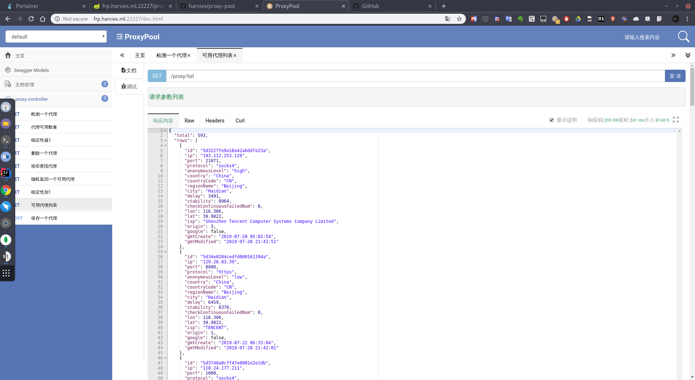
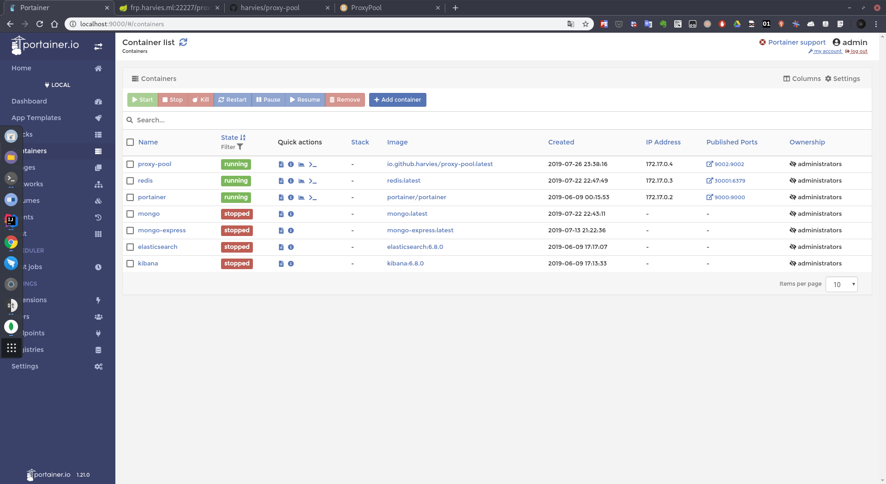
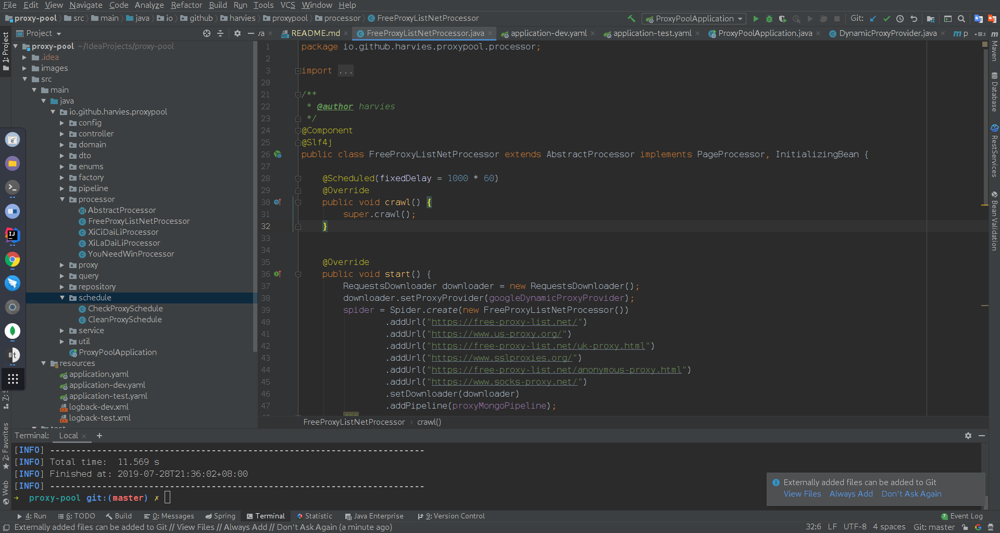

# 代理IP抓取检测程序

## 此项目开发的目的?

一次对mongodb的学习,想抓取github仓库练手,发现github有反爬限制(单ip最多5个线程),于是在网上找了很多代理ip抓取程序,发现不太好用.于是想自己动手开发了本程序的初级版本.最后使用作者自己的电脑几天时间抓取了github 100万个仓库的数据(该项目后面会开源).

## 常见问题?

1.项目打开提示没有GetSet方法?

> 请安装lombok插件

2.为什么采用mongodb而不是redis,mysql?

> 此项目需要按条件搜索,不需要使用事务,mongodb刚好符合

## 特性

支持多代理源按不同间隔抓取

多线程检测代理

各种API支持(分页搜索排序,检测,删除,稳定性加减等)

代理抓取程序开发简单

docker部署

## 使用技术

[SpringBoot2](https://spring.io/projects/spring-boot)

[MongoDB](https://www.mongodb.com/)

[WebMagic](https://github.com/code4craft/webmagic)

## 项目截图







## 接口

### 可用代理列表 http://frp.harvies.ml:22227/proxy/list?offset=0&limit=10

### 随机获取一个可用代理 http://frp.harvies.ml:22227/proxy/get

> 其他接口见swagger接口文档 http://frp.harvies.ml:22227/doc.html

## 待办事项
1. 项目maven模块化(方便其他项目依赖)
2. 增加更多代理网站

## 演示程序(个人电脑docker容器里的)

http://frp.harvies.ml:22227/proxy/list


## docker打包

```bash
# rm -rf ~/.m2/repository/io/github/harvies/
sudo mvn clean install -DskipTests
cd proxy-pool-web
sudo mvn  clean package  dockerfile:build -DskipTests -Ptest
```

## 感谢以下项目

https://github.com/dxxzst/free-proxy-list

https://github.com/code4craft/webmagic
